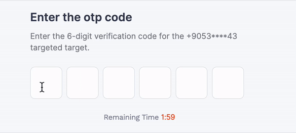

<p align="center">
  <a href="" rel="noopener">
 </a>
</p>

<h3 align="center">otp-mtolia</h3>

<div align="center">

[]()
[](https://github.com/gizemay96/otp/issues)
[](https://github.com/gizemay96/otp/pulls)
[](/LICENSE)

</div>

<h1> <a style="color: #ff4308" target="_blank" href="https://stackblitz.com/edit/stackblitz-starters-vzx3e7?description=React%20%20%20TypeScript%20starter%20project&file=src%2FApp.tsx,src%2Fstyle.css,src%2Findex.tsx&title=React%20Starter" >Demo (Stackblitz) </a> </h1>

---

<br>
<br>

<p align="center"> Intro </p>

<p align="center">
  
</p>

<br>
<br>

## 📝 Table of Contents

- [<span style="color:#ff4308">About</span>](#about)
- [<span style="color:#ff4308">Getting Started</span>](#getting_started)
- [<span style="color:#ff4308">Usage</span>](#usage)
- [<span style="color:#ff4308">Built Using</span>](#built_using)
- [<span style="color:#ff4308">Contributing</span>](../CONTRIBUTING.md)
- [<span style="color:#ff4308">Authors</span>](#authors)
- [<span style="color:#ff4308">Acknowledgments</span>](#acknowledgement)

<br>

## 🧐 About <a name = "about"></a>

With this library, you can get a ready input where you can get your one-time passwords from the user and style it. The user can fill in the input with a single button on the clipboard on mobile devices.

<br>

## 🏁 Getting Started <a name = "getting_started"></a>

This package is made for reactjs. First, review the Prerequisites section below. And if there is a missing package in your project, install it.

### Prerequisites

What things you need to install the software and how to install them.

```
npm i react
```

```
npm i typescript
```

### Installing

Firstly, add the npm package to your project by typing the following line into the terminal.


```
npm i otp-mtolia
```


## 🎈 Usage <a name="usage"></a>

### With React Hook Form
```javascript
import OtpInput from "otp-mtolia";
import React from "react";
import { Controller, SubmitHandler, useForm } from "react-hook-form";
import styles from "../otp/otp.module.scss";

interface otpForm {
  otp: any;
}

export const OtpScreen = () => {

  //#region Form & Submit
  const {
    handleSubmit,
    formState: { errors, isSubmitted, isValid },
    setValue,
  } = useForm<otpForm>({});

  const onSubmit: SubmitHandler<otpForm> = (data) => {
    console.log(data);
  };

  //#endregion

  //#region JSX
  return (
    <div className={styles.otpScreen}>

      <h4>OTP Page</h4>

      <form onSubmit={handleSubmit(onSubmit)}>

        {/* OTP From Package*/}
        <OtpInput inputCount={6} onChangedOtp={(value: string) => setValue('otp', value)} inputClassName={styles.otpInput} />

        <button type="submit">  Submit </button>
      </form>
      
    </div>
  );
  //#endregion
};

```
<br>
<br>
<br>
<br>

<table>
<tr>
<th></th>
<th>Key</th>
<th>Type</th>
<th>Default</th>
<th>Description</th>
</tr>

<tr>
<td>@Input</td>
<td>inputCount</td>
<td>number</td>
<td>4</td>
<td>Otp input count</td>
</tr>

<tr>
<td>@Input</td>
<td>inputClassName</td>
<td>string</td>
<td>""</td>
<td>You can style the input by assigning a value to the class name you have given to this field.</td>
</tr>

<tr>
<td>@Output</td>
<td>onChangedOtp</td>
<td>Function</td>
<td>-</td>
<td>Last value entered in the input</td>
</tr>

</table>

<br>
<br>
<br>

## ⛏️ Built Using <a name = "built_using"></a>

- [<span style="color:#ff4308">ReactJS</span>](https://react.dev/) - Framework
- [<span style="color:#ff4308">styled-components</span>](https://www.npmjs.com/package/styled-components) - Styling
- [<span style="color:#ff4308">TypeScript</span>](https://www.npmjs.com/package/typescript)

## ✍️ Authors <a name = "authors"></a>

- [<span style="color:#ff4308">@moneytolia</span>](https://github.com/moneytolia) - Idea & Initial work
- [<span style="color:#ff4308">@ercancan</span>](https://github.com/lErcanl) - Developer
- [<span style="color:#ff4308">gizemay</span>](https://github.com/gizemay96) - Developer
- [<span style="color:#ff4308">suayipdemirci</span>](https://github.com/kylelobo) - Developer
- [<span style="color:#ff4308">baranörek</span>](https://github.com/kylelobo) - Developer